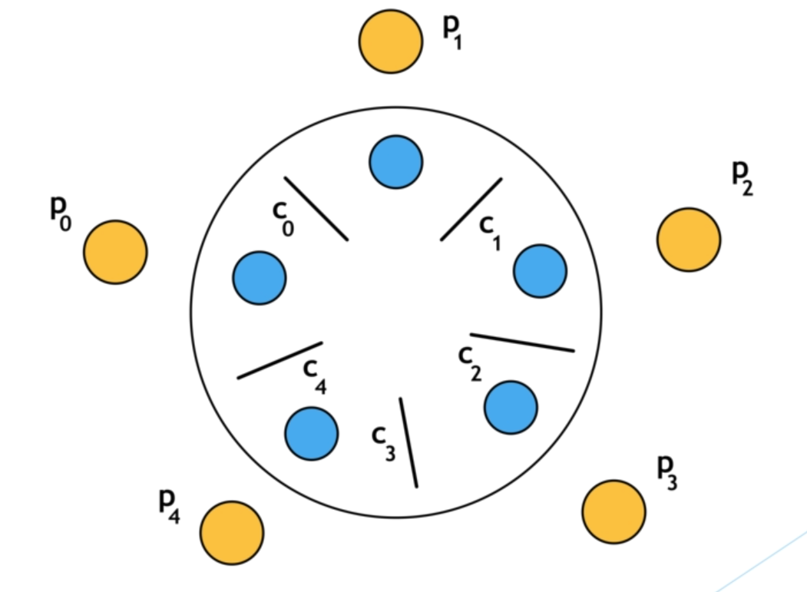

# Dining Philosophers Problem

The problems is that there are 5 philosophers present at a table and there are
5 forks (chopsticks). The philosophers can eat and think.

Philosophers can eat when they have both left and right chopsticks. A
chopstick can be hold by one philosopher at a given time.

**Problem**: Create a concurrent Algorithm such that no philosopher will starve (the goal is to avoid deadlocks).



## Before you start

### Lock methods
There are some methods for `Lock` interface:

+ `void lock()` – Acquire the lock if it’s available. If the lock isn’t available, a thread gets blocked until the lock is released.

+ `void lockInterruptibly()` – This is similar to the lock(), but it allows the blocked thread to be interrupted and resume the execution through a thrown java.lang.InterruptedException.

+ `boolean tryLock()` – This is a nonblocking version of lock() method. It attempts to acquire the lock immediately, return true if locking succeeds.

+ `boolean tryLock(long timeout, TimeUnit timeUnit)` – This is similar to tryLock(), except it waits up the given timeout before giving up trying to acquire the Lock.

+ `void unlock()` unlocks the Lock instance.

To avoid deadlock in dining philosophers problem, you should use `tryLock` method.


### ExecutorService

ExecutorService is a JDK API that simplifies running tasks in asynchronous mode. Generally speaking, ExecutorService automatically provides a pool of threads and an API for assigning tasks to it.

#### Instantiating ExecutorService
The easiest way to create ExecutorService is to use one of the factory methods of the Executors class.

For example, the following line of code will create a thread pool with 5 threads:
```java
ExecutorService executor = Executors.newFixedThreadPool(5);
```

#### Assigning Tasks to the ExecutorService

The execute() method is void and doesn’t give any possibility to get the result of a task’s execution or to check the task’s status (is it running):
```java
executorService.execute(runnableTask);
```

#### Shutting Down an ExecutorService

The shutdown() method doesn’t cause immediate destruction of the ExecutorService. It will make the ExecutorService stop accepting new tasks and shut down after all running threads finish their current work:
```java
executorService.shutdown();
```

#### Check if ExecutorService is terminated
This is one way you can check if the service is termianted of not and wait until it terminates the processes.

```java
while(!executorService.isTerminated()) {
    Thread.sleep(100);
}
```

## Implementation

There are some classes which you should implement.

### Constants
+ NUMBER_OF_PHILOSOPHERS: an integer
+ NUMBER_OF_CHOPSTICKS: an integer
+ SIMULATION_RUNNING_TIME: an integer (miliseconds)

### State
An enum with values: `LEFT` and `RIGHT` which we will use it in chopsticks for tracing the process.

### Chopstick
properties:

+ `id`: an integer which is the id of a chopstick
+ `Lock`: a lock for accuiring the chopstick

methods:

For picking up the chopstick:
```java
public boolean pickUp(Philosopher philosopher, State state){}
```
Return true if picking up the chopstick was successfull.

__Note that the `philosopher` and `state` parameters are just for tracing the process. You don't need it actually.__

For picking down the chopstick:
```java
public void putDown(Philosopher philosopher, State state){}
```
__Note that the `philosopher` and `state` parameters are just for tracing the process. You don't need it actually.__


### Philosopher
properties:
+ `id`: an integer which is the id of a philosopher
+ `leftChopstick`: a chopstick object (which is the left chopstick of the philosopher)
+ `rightChopstick`: a chopstick object (which is the right chopstick of the philosopher)
+ `eatingCounter`: number of eating times of the philosopher
+ `isHungry`: a boolean which states if the philospher is hungry or not. The initial value is `false`

optional:
+ `random`: a `Random` object for simulating eating of everything within a time frame

methods:
+ `think`: simulate thinking operation. You just neet to print and wait for an amount of time
+ `eat`: simulate eating operation. You just neet to print and wait for an amount of time. Don't forget to increment `eatingCounter`
+ `run`: override the run method of `Thread` or `Runnable` interface to simulate the philosopher actions. While the philospher is hungry, he/she thinks for a while and then it tries to get the right and left chopstick. If he/she could do that, the philospher eats something, and then puts down both chopsticks.


### Main
Initialize the chopsticks and philosophers. Using the `ExecutorService`, execute the process of each philosopher in a separte thread.

After executing all threads, wait for `SIMULATION_RUNNING_TIME`. After that, set each philosopher `isHungry` property to `true` since we don't want to continue the actions of philosophers.

Make sure to wait for executor service to be terminated.

Check how many times each philosopher ate something by printing the `eatingCounter` property.