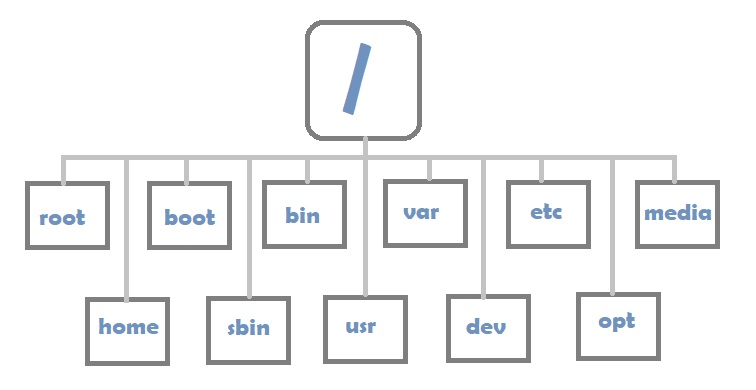
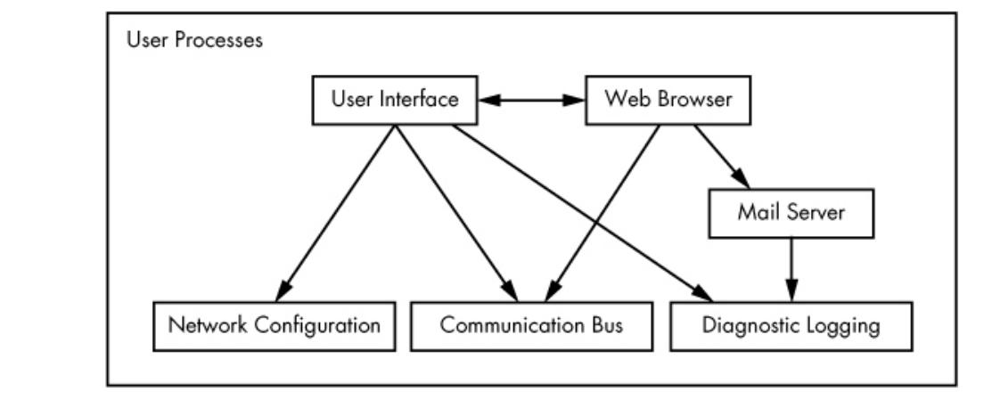
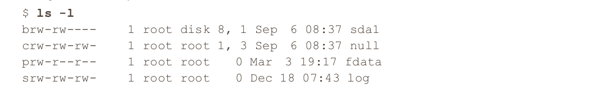
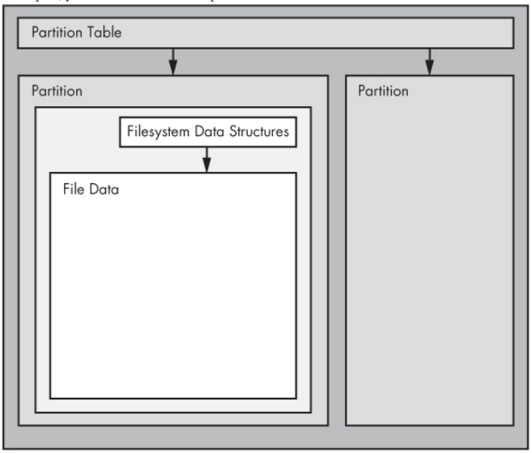
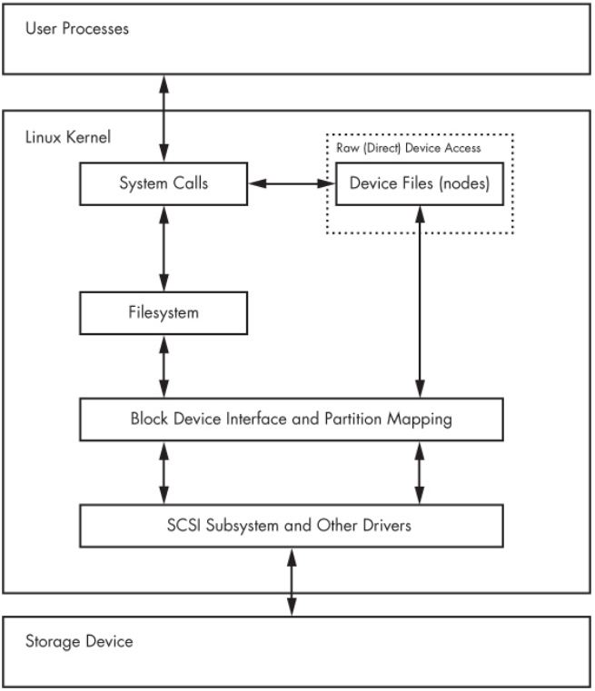
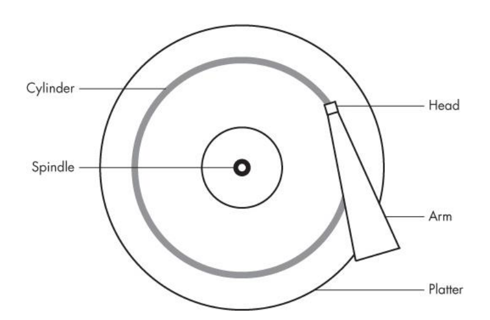
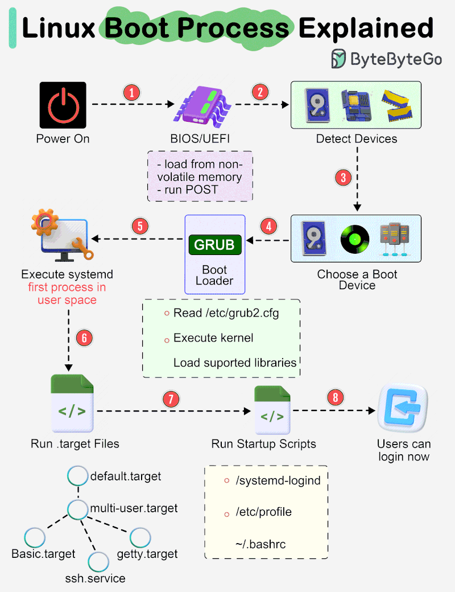

# Operating System Lab

## Section 7


## How Linux Works

### The Big Picture

#### Levels and Layers of Abstraction in Linux

The Linux system is organized into three main levels:
- hardware
- kernel
- user space.

The kernel, residing in memory, acts as the core and interface between
hardware and running programs.

User processes in the upper level operate in
user mode, with restricted access, preventing system-wide crashes.

Kernel processes, in kernel mode, have unrestricted access but are safeguarded
to prevent serious damage.



### The Kernel

Nearly everything that the kernel does revolves around
main memory. One of the kernel’s tasks is to split memory into many subdivisions, and it must maintain certain
state information about those subdivisions at all times.

The kernel is in charge of managing tasks in four general system areas:
- Processes. The kernel is responsible for determining which processes are allowed to use the CPU.
- Memory. The kernel needs to keep track of all memory—what is currently allocated to a particular process,
what might be shared between processes, and what is free.
- Device drivers. The kernel acts as an interface between hardware (such as a disk) and processes. It’s
usually the kernel’s job to operate the hardware.
- System calls and support. Processes normally use system calls to communicate with the kernel.

#### Process Management
On any modern operating system, many processes run “simultaneously.” For example, you might have a web
browser and a spreadsheet open on a desktop computer at the same time. However, things are not as they
appear: The processes behind these applications typically do not run at exactly the same time.

Consider a system with a one-core CPU. Many processes may be able to use the CPU, but only one process
may actually use the CPU at any given time. In practice, each process uses the CPU for a small fraction of a
second, then pauses; then another process uses the CPU for another small fraction of a second; then another
process takes a turn, and so on. The act of one process giving up control of the CPU to another process is
called a context switch.

Each piece of time—called a time slice—gives a process enough time for significant computation.

The kernel is responsible for context switching. To understand how this works, let’s think about a situation in
which a process is running in user mode but its time slice is up. Here’s what happens:
1. The CPU (the actual hardware) interrupts the current process based on an internal timer, switches into
   kernel mode, and hands control back to the kernel.
2. The kernel records the current state of the CPU and memory, which will be essential to resuming the
   process that was just interrupted.
3. The kernel performs any tasks that might have come up during the preceding time slice (such as
   collecting data from input and output, or I/O, operations).
4. The kernel is now ready to let another process run. The kernel analyzes the list of processes that are ready
   to run and chooses one.
5. The kernel prepares the memory for this new process, and then prepares the CPU.
6. The kernel tells the CPU how long the time slice for the new process will last.
7. The kernel switches the CPU into user mode and hands control of the CPU to the process.

#### Memory Management
Because the kernel must manage memory during a context switch, it has a complex job of memory
management. The kernel’s job is complicated because the following conditions must hold:
- The kernel must have its own private area in memory that user processes can’t access.
- Each user process needs its own section of memory.
- One user process may not access the private memory of another process.
- User processes can share memory.
- Some memory in user processes can be read-only.
- The system can use more memory than is physically present by using disk space as auxiliary.

Fortunately for the kernel, there is help. Modern CPUs include a memory management unit (MMU) that
enables a memory access scheme called virtual memory. When using virtual memory, a process does not
directly access the memory by its physical location in the hardware. Instead, the kernel sets up each process
to act as if it had an entire machine to itself. When the process accesses some of its memory, the MMU
intercepts the access and uses a memory address map to translate the memory location from the process into
an actual physical memory location on the machine. The kernel must still initialize and continuously maintain
and alter this memory address map. For example, during a context switch, the kernel has to change the map
from the outgoing process to the incoming process.

#### Device Drivers and Management

A device is typically accessible only in kernel mode because
improper access could crash the machine. Another
problem is that different devices rarely have the same programming interface, even if the devices do the same
thing, such as two different network cards. Therefore, device drivers have traditionally been part of the kernel,
and they strive to present a uniform interface to user processes in order to simplify the software developer’s
job.

#### System Calls and Support
There are several other kinds of kernel features available to user processes. For example, system calls (or
syscalls) perform specific tasks that a user process alone cannot do well or at all. For example, the acts of
opening, reading, and writing files all involve system calls.
Two system calls, fork() and exec(), are important to understanding how processes start up:
- fork() When a process calls fork(), the kernel creates a nearly identical copy of the process.
- exec() When a process calls exec(program), the kernel starts program, replacing the current
process.

Other than init (which we talk later), all user processes on a Linux system start as a result of fork(), and most of
the time, you also run exec() to start a new program instead of running a copy of an existing process. A
very simple example is any program that you run at the command line, such as the ls command to show the
contents of a directory. When you enter ls into a terminal window, the shell that’s running inside the terminal
window calls fork() to create a copy of the shell, and then the new copy of the shell calls exec(ls) to
run ls.


#### User Space

As mentioned earlier, the main memory that the kernel allocates for user processes is called user space.
Because a process is simply a state (or image) in memory, user space also refers to the memory for the entire
collection of running processes.

Basic services are at the bottom level (closest to the kernel), utility
services are in the middle, and applications that users touch are at the top.

The picture is a greatly simplified diagram because only six components are shown, but you can see that the
components at the top are closest to the user.



The bottom level tends to consist of small components that perform single, uncomplicated tasks. The middle
level has larger components such as mail, print, and database services. Finally, components at the top level
perform complicated tasks that the user often controls directly. Components also use other components.
Generally, if one component wants to use another, the second component is either at the same service level or
below.


### Devices
It is easy to manipulate most devices on a Unix system because the kernel presents many of the device I/O
interfaces to user processes as files. These device files are sometimes called device nodes. Not only can a
programmer use regular file operations to work with a device, but some devices are also accessible to standard
programs like cat, so you don’t have to be a programmer to use a device. However, there is a limit to what
you can do with a file interface, so not all devices or device capabilities are accessible with standard file I/O.

Linux uses the same design for device files as do other Unix flavors. Device files are in the /dev directory, and
running ls /dev reveals more than a few files in /dev.

```bash
echo blah > /dev/null
```

As does any command with redirected output, this sends some stuff from the standard output to a file. However,
the file is /dev/null, a device, and the kernel decides what to do with any data written to this device. In the case
of /dev/null, the kernel simply ignores the input and throws away the data.

consider this example:



If this character is b, c, p, or s, the file is a device.
These letters stand for block, character, pipe, and socket, respectively, as
described in more detail below.

- Block device: Programs access data from a block device in fixed chunks. The sda1 in the preceding example is a disk
device, a type of block device.
- Character device: Character devices work with data streams. You can only read characters from or write characters to
  character devices, as previously demonstrated with /dev/null. Character devices don’t have a size; when you
  read from or write to one, the kernel usually performs a read or write operation on the device. Printers
  directly attached to your computer are represented by character devices
- Pipe device: Named pipes are like character devices, with another process at the other end of the I/O stream instead of a
  kernel driver.
- Socket device: Sockets are special-purpose interfaces that are frequently used for interprocess communication. They’re
  often found outside of the /dev directory.

#### Sysfs device path
The traditional Unix /dev directory is a convenient way for user processes to reference and interface with
devices supported by the kernel, but it’s also a very simplistic scheme. The name of the device in /dev tells
you a little about the device, but not a lot. Another problem is that the kernel assigns devices in the order in
which they are found, so a device may have a different name between reboots.

To provide a uniform view for attached devices based on their actual hardware attributes, the Linux kernel
offers the sysfs interface through a system of files and directories. The base path for devices is /sys/devices.

As you can see, this path is quite long compared with the /dev/sda filename, which is also a directory. But you
can’t really compare the two paths because they have different purposes. The /dev file is there so that user
processes can use the device, whereas the /sys/devices path is used to view information and manage the device.

```bash
udevadm info --query=all --name=/dev/sda
```

### Device Name Summary

#### Hard Disks: /dev/sd*
Most hard disks attached to current Linux systems correspond to device names with an sd prefix, such as
/dev/sda, /dev/sdb, and so on. These devices represent entire disks; the kernel makes separate device files,
such as /dev/sda1 and /dev/sda2, for the partitions on a disk.

```bash
df -h
```

#### CD and DVD Drives: /dev/sr*
Linux recognizes most optical storage drives as the SCSI devices /dev/sr0, /dev/sr1, and so on. However, if
the drive uses an older interface, it might show up as a PATA device, as discussed below.

```bash
lsblk
```

#### Terminals: /dev/tty*, /dev/pts/*, and /dev/tty

Terminals are devices for moving characters between a user process and an I/O device, usually for text output
to a terminal screen. The terminal device interface goes back a long way, to the days when terminals were
typewriter-based devices.

The /dev/tty device is the controlling terminal of the current process. If a program is currently reading from
and writing to a terminal, this device is a synonym for that terminal. A process does not need to be attached to
terminal.

#### Serial Ports: /dev/ttyS*
Older RS-232 type and similar serial ports are special terminal devices. You can’t do much on the command
line with serial port devices because there are too many settings to worry about, such as baud rate and flow
control.

The port known as COM1 on Windows is /dev/ttyS0; COM2 is /dev/ttyS1; and so on. Plug-in USB serial
adapters show up with USB and ACM with the names /dev/ttyUSB0, /dev/ttyACM0, /dev/ttyUSB1,
/dev/ttyACM1, and so on.

#### Parallel Ports: /dev/lp0 and /dev/lp1
#### Audio Devices: /dev/snd/*, /dev/dsp, /dev/audio, and More


### Disks and Filesystems
Recall that disk devices have names like /dev/sda, the first SCSI subsystem disk. This kind of block device
represents the entire disk, but there are many different components and layers inside a disk.



Partitions are subdivisions of the whole disk. On Linux, they’re denoted with a number after the whole block
device, and therefore have device names such as /dev/sda1 and /dev/sdb3. The kernel presents each partition
as a block device, just as it would an entire disk. Partitions are defined on a small area of the disk called a
partition table.

The next layer after the partition is the filesystem, the database of files and directories that you’re accustomed
to interacting with in user space.

To access data on a disk, the Linux kernel uses the system of layers shown in picture below.



#### Viewing a Partition Table
You can view your system’s partition table with `parted -l`.


#### Disk and Partition Geometry
The disk consists of a spinning platter on a spindle, with a head attached to a moving arm that can sweep
across the radius of the disk. As the disk spins underneath the head, the head reads data. When the arm is in
one position, the head can only read data from a fixed circle. This circle is called a cylinder because larger
disks have more than one platter, all stacked and spinning around the same spindle. Each platter can have one
or two heads, for the top and/or bottom of the platter, and all heads are attached to the same arm and move in
concert. Because the arm moves, there are many cylinders on the disk, from small ones around the center to
large ones around the periphery of the disk. Finally, you can divide a cylinder into slices called sectors. This
way of thinking about the disk geometry is called CHS, for cylinder-head-sector.



The kernel and the various partitioning programs can tell you what a disk reports as its number of cylinders
(and sectors, which are slices of cylinders). However, on a modern hard disk, the reported values are fiction!
The traditional addressing scheme that uses CHS doesn’t scale with modern disk hardware, nor does it account
for the fact that you can put more data into outer cylinders than inner cylinders. Disk hardware supports
Logical Block Addressing (LBA) to simply address a location on the disk by a block number, but remnants of
CHS remain. For example, the MBR partition table contains CHS information as well as LBA equivalents,
and some boot loaders are still dumb enough to believe the CHS values (don’t worry—most Linux boot loaders
use the LBA values).


#### Solid-State Disks (SSDs)
Storage devices with no moving parts, such as solid-state disks (SSDs), are radically different from spinning
disks in terms of their access characteristics. For these, random access is not a problem because there’s no
head to sweep across a platter, but certain factors affect performance.

One of the most significant factors affecting the performance of SSDs is partition alignment. When you read
data from an SSD, you read it in chunks— typically 4096 bytes at a time—and the read must begin at a
multiple of that same size. So if your partition and its data do not lie on a 4096-byte boundary, you may have
to do two reads instead of one for small, common operations, such as reading the contents of a directory.

```bash
cat /sys/block/sda/sda2/start
```

### Filesystems
The last link between the kernel and user space for disks is typically the file-system; this is what you’re
accustomed to interacting with when you run commands such as ls and cd. As previously mentioned, the
filesystem is a form of database; it supplies the structure to transform a simple block device into the
sophisticated hierarchy of files and subdirectories that users can understand.

The Virtual File System (VFS) abstraction layer completes the filesystem implementation. Much as the SCSI
subsystem standardizes communication between different device types and kernel control commands, VFS
ensures that all filesystem implementations support a standard interface so that user-space applications access
files and directories in the same manner. VFS support has enabled Linux to support an extraordinarily large
number of filesystems.

Linux filesystem support includes native designs optimized for Linux:
- The Fourth Extended filesystem (ext4) is the current iteration of a line of filesystems native to Linux
- ISO 9660 (iso9660) is a CD-ROM standard
- FAT filesystems (msdos, vfat, umsdos) pertain to Microsoft systems
- HFS+ (hfsplus) is an Apple standard used on most Macintosh systems.

New Linux filesystems, such as Btrfs, are under development and may be
poised to replace the Extended series due to some problems.

#### Mounting a Filesystem
On Unix, the process of attaching a filesystem is called mounting. When the system boots, the kernel reads
some configuration data and mounts root (/) based on the configuration data.

In order to mount a filesystem, you must know the following:
- The filesystem’s device (such as a disk partition; where the actual file-system data resides).
- The filesystem type.
- The mount point—that is, the place in the current system’s directory hierarchy where the filesystem will be
attached. The mount point is always a normal directory. For instance, you could use /cdrom as a mount
point for CD-ROM devices. The mount point need not be directly below /; it may be anywhere on the
system.

```bash
mount
```

```bash
mount -t ext4 /dev/sda2 /home/amirhosein/mnt
```

#### The /etc/fstab Filesystem Table
To mount filesystems at boot time and take the drudgery out of the mount command, Linux systems keep a
permanent list of filesystems and options in /etc/fstab.

Each line corresponds to one filesystem, each of which is broken into six fields. These fields are as follows,
in order from left to right:
- The device or UUID. Most current Linux systems no longer use the device in /etc/fstab, preferring the
UUID. (Notice that the /proc entry has a stand-in device named proc.)
- The mount point. Indicates where to attach the filesystem.
- The filesystem type. You may not recognize swap in this list; this is a swap partition (see 4.3 swap space).
- Options. Use long options separated by commas.
- Backup information for use by the dump command. You should always use a 0 in this field.
- The filesystem integrity test order. To ensure that fsck always runs on the root first, always set this to 1
  for the root filesystem and 2 for any other filesystems on a hard disk. Use 0 to disable the bootup check for
  everything else, including CD-ROM drives, swap, and the /proc file-system

### Swap space
Not every partition on a disk contains a filesystem. It’s also possible to augment the RAM on a machine with
disk space. If you run out of real memory, the Linux virtual memory system can automatically move pieces of
memory to and from a disk storage. This is called swapping because pieces of idle programs are swapped to
the disk in exchange for active pieces residing on the disk. The disk area used to store memory pages is called
swap space (or just swap for short).

```bash
free
```

## How the linux kernel boots

Big picture:



Another definition from another book:

A simplified view of the boot process looks like this:
1. The machine’s BIOS or boot firmware loads and runs a boot loader.
2. The boot loader finds the kernel image on disk, loads it into memory, and starts it.
3. The kernel initializes the devices and its drivers.
4. The kernel mounts the root filesystem.
5. The kernel starts a program called init with a process ID of 1. This point is the user space start.
6. init sets the rest of the system processes in motion.
7. At some point, init starts a process allowing you to log in, usually at the end or near the end of the boot.

### Startup Messages
The messages come first from the kernel and then from processes and initialization procedures that init starts.
However, these messages aren’t pretty or consistent, and in some cases they aren’t even very informative.
Most current Linux distributions do their best to hide them with splash screens, filler, and boot options. In
addition, hardware improvements have caused the kernel to start much faster than before; the messages flash
by so quickly, it can be difficult to see what is happening.

One way to view the kernel’s boot and runtime diagnostic messages is using the dmesg command:

```bash
dmesg
```

## How User Space Starts

TODO