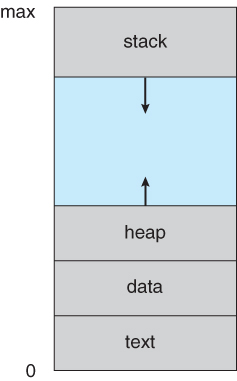
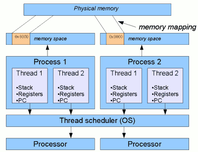
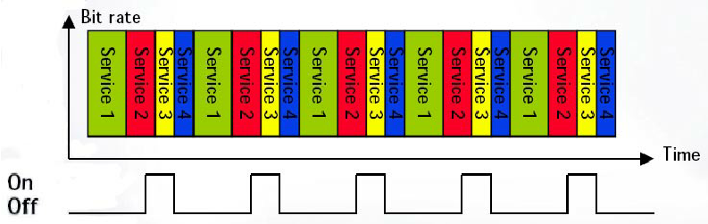
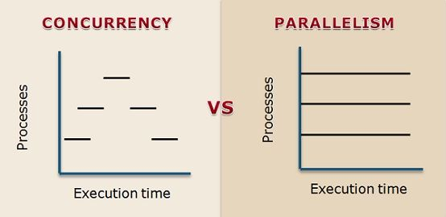
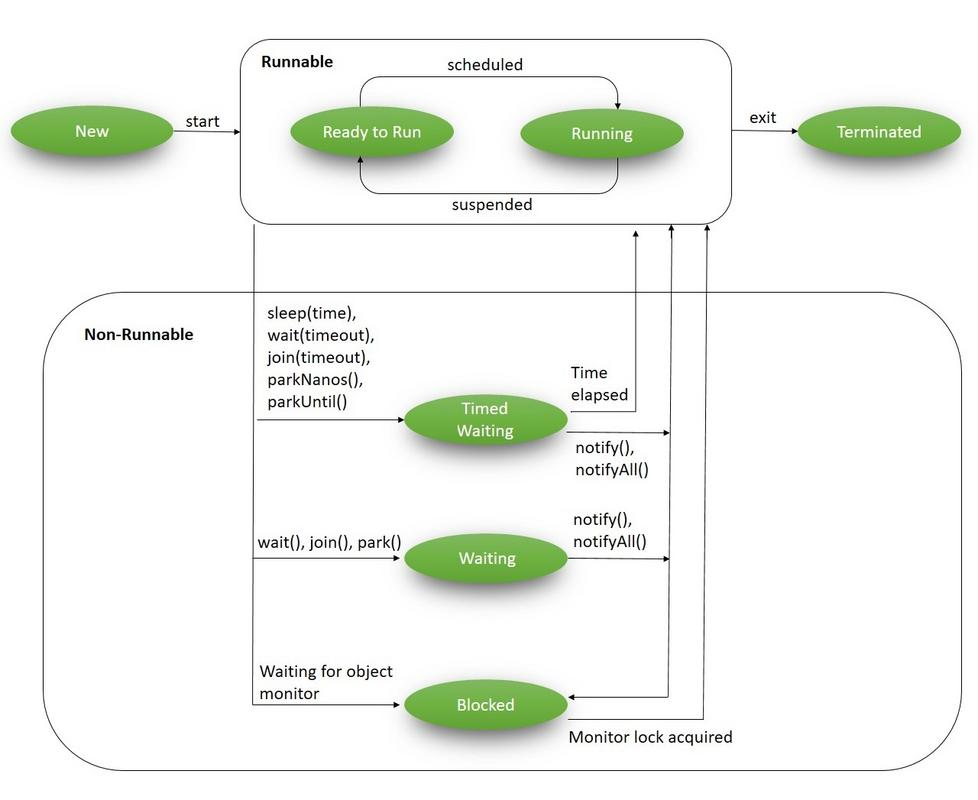

# Operating System Lab

## Section 1

## Overview
At the first section we talked about some concepts about processes, threads, multi threading and so on.
Then we started to work with the fundamentals of multi-threading in java.

## Sequential programming
Sequential programming is the process of programming multiple devices in a chain,
one device at a time. After the process of programming the first device in the chain
is complete, the next device is programmed.

## What is the problem with sequential programming?
The fundamental problem is that while a sequential program is waiting for one kind of event
(e.g., timeout event after a time delay) it is not doing anything else and is not responsive
to other events (e.g., a button press). The hard-coded event sequences are simply not flexible
enough for most real-life problems.

## What is process?
In computing, a process is the instance of a computer program that is being executed
by one or many threads.

The process contains multiple things: id, name, memory...

This is a simple view of memory for a process:

## What is thread?

Within a program, a Thread is a separate execution path. It is a lightweight
process that the operating system can schedule and run concurrently with other threads.
The operating system creates and manages threads, and they share the same memory and
resources as the program that created them. This enables multiple threads to collaborate
and work efficiently within a single program.

## Multi-threading
Multithreading is the ability of a program or an operating system to enable more
than one user at a time without requiring multiple copies of the program running on the
computer. Multithreading can also handle multiple requests from the same user.

## Time-slicing
It is timeframe for which process or thread is allotted to run in preemptive multitasking CPU.
The scheduler runs each process every single time-slice. The period of each time slice
can be very significant and crucial to balance CPUs performance and responsiveness.

## Concurrency vs Parallelism

Concurrency is when multiple tasks can run in overlapping periods.
It's an illusion of multiple tasks running in parallel because of a very fast
switching by the CPU. Two tasks can't run at the same time in a single-core CPU.
Parallelism is when tasks actually run in parallel in multiple CPUs or cores.

## Advantages of multi-threading

1. Responsive
2. CPU utilizing
3. Overall performance

## Downsides of multi-threading

1. Shared memory (we have to manage synchronization)
2. Complexity
3. Sometimes switching between threads are expensive

## Thread life-cycles in java

