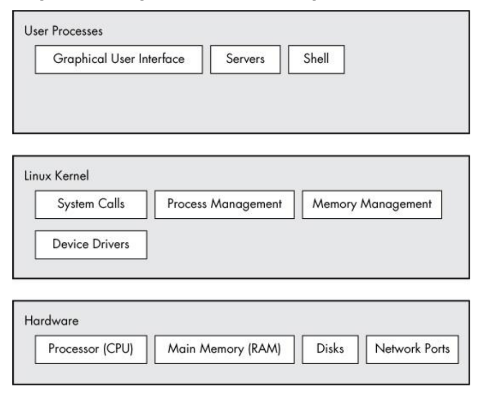

# Operating System Lab


## Open Terminal

## Basic commands

Can you examine the file explorer window and answer the following questions?

- What is the name of the current working directory (a.k.a. present working directory)?
- Which is the immediate parent directory?
- Can you list the names of files and sub-directories in the present working directory?
- Which file has the largest size?
- Which file was modified most recently?

### pwd

### ls

1. Directories are in blue
2. Files are in white
3. Executables are in green (we will learn more about executable files later)

### cd

### Default arguments
- What if you execute the cd command without any destination? Can you try it and see where it takes you? (Hint: Use pwd to check where you were taken to)
- Can you try the ls command with a directory name?
- Experiment with the cd and ls commands with different arguments.

**Note**
- If you don’t provide any argument to the cd command, it defaults to the user’s home directory. The ls command defaults to the present working directory.
- There is a symbol to denote a user’s home directory. The tilde (~) sign.

- `cd ~` will take you to your home directory.

- `ls ~` will list the contents of your home directory.

## Directory Structure



### /
This directory is called as the ‘root’ directory. It is at the top of the file system structure. All other directories are placed under it.

### /root
The default home directory of the root. In Linux Unix the administrator is called as Root.

### /home
It contains the home directory of all users (similar to ‘documents and settings’ folder in Windows). When any user logs in the current working directory by default is the user’s home directory.

### /boot
It contains the kernel, which is the core of the operating system. it also contains the files related for booting the OS such as the boot loader.

### /sbin
sbin stands for system binary.  It contains essential system commands which can only be used by the superuser (root). Example – fdisk, dump etc.

### /bin
bin stands for binary. It contains essential commands which are used by all users. Example – ping, cat, chmodetc.

### /usr
usr stands for UNIX system resources. It contains the programs and applications which are available for users (smililar to program files in Windows)

### /var
var stands for variable. It contains variable information, such as lags and print queues.

### /dev
dev stands for device. It contains information about all hardware devices.

### /etc
etc etc stands for et cetera. It contains all configuration files.

### /opt
opt stands for optional. It generally contains the third party software. example – open office etc.

### /media
It is the default mount point for removable storage media such as cdrom/dvd and pendrives etc.


**TODO** - List the contents of the /var directory in long format using the ls command learned in the previous section.

### Absolute path

### Relative path

### Commands (Cont'd)


### man

- NAME - name of the command & short description of what it does
- SYNPOSIS - how the command is used
- DESCRIPTION - detailed info on the usage of the command

### echo
run  this command in terminal
```bash
echo "echo 'Congratulations on running a bash script'" > run.sh
```

### cat
output the content of a file

### How to run the executable file?

### chmod


### **TODO**
- Find a command that prints out all sub-directories and files recursively
- List the files in long form and sort the files according to their modification time

### Package Manager
Update the package list and install `tree` command.

```bash
sudo apt update
sudo apt install tree
```

### CRUD operations

You have to create this hierarchy using some commands in linux.

```
.
└── kgf
    ├── cast.txt
    ├── part1
    │   └── synopsis.txt
    └── part2
        └── cast.txt

3 directories, 3 files
```

You may need these commands to do so:

- mkdir
- cp
- touch
- cd
- rm

When you verified your tree, rename the `cast.txt` in part2 to `cast-new.txt`. What command
should we use? `mv`

### Feeding Output of a command to the Input of another

output the contents of the `/proc/meminfo`

### grep
`grep` command is used to filter/search for text using strings or patterns.

It’s usage is `grep <pattern> <file>`

Please output the `MemFree` line for `/proc/meminfo`

Write the output to a file named: `memFreeLine.txt` using `>` operator

### awk
Now, how will we fetch only the numerical value?

```bash
awk '{print $2}' memFreeLine.txt
```

#### Piping

```bash
grep MemFree /proc/meminfo | awk '{print $2}' > memFreeNumber.txt
```

## Exercise
**Log Analysis with Hadoop**
- Download the tar file:

```bash
wget https://zenodo.org/record/3227177/files/Hadoop.tar.gz -O "Hadoop.tar.gz"
```
- Extract the tar file. Please search the extract command.

### TODO 1

#### How many log files do we have?

Each log file ends with `.log`

commands: `find` and `wc`

Search the arguments that you should use

#### Number of ERRORs seen across all logs

You should recursively go through all files and find the `ERROR`.

commands: `grep` and `wc`

Search the arguments that you should use

#### Number of FATAL, WARN, INFO

Use the same commands in the previous task

#### Number of Exceptions seen

Use the same commands in the previous task

- Which of these exceptions are related to the disk being full?

### TODO 2

**Bash Scripting**

Download the python file:

```bash
wget https://gitlab.crio.do/crio_bytes/me_encapsulation/-/raw/9c845bb7364b64fada328e44b75def128388ffe5/user_preference.py
```

Before you start:

How to save the second argument in a vaiable?

```bash
python_file="$1"
```

if block syntax:
```bash
if [ 1 -eq 0 ]; then
	echo "1 is equal to 0"
else 
    echo "1 is not equal to 0"
fi
```

exit from the script:
```bash
exit 1
```

1. Write a script to remove all the comment lines (We only consider lines that starts with `#` character)

You should use `sed` command with this regular expression: `'/^[[:space:]]*#/d'`

2. Before removing the comment lines, create a copy of the file for backup.
3. If you provide a wrong name for your file, your script will face an error. Check if the filename 
exists or not. If not, print a message to say the file with that name does not exist.
4. If you don't provide any name, your program will face an error again. Check if user provided any argument or not.
If not, print a message to say how really is the usage of the script.
